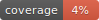

<h1 align="center">clothion</h1>
<p align="center">
Embed widgets in your Notion pages easily
</p>

<p align="center">
    <a href="https://github.com/astariul/clothion/actions/workflows/pytest.yaml"></a>
    <a href="https://github.com/astariul/clothion/actions/workflows/lint.yaml"></a>
    
    <a href="https://github.com/astariul/clothion/blob/main/LICENSE"></a>
</p>

<p align="center">
  <a href="#description">Description</a> •
  <a href="#usage">Usage</a> •
  <a href="#faq">FAQ</a> •
  <a href="#self-host">Self-host</a> •
  <a href="#contribute">Contribute</a>
  <br>
  <a href="https://clothion-docs.remond.co/">Documentation</a>
</p>


<h2 align="center">Description</h2>

Clothion is a **free**, **open-source** tool that allows you to build charts and other widgets directly from your Notion database.

You can then **embed** the widgets into your Notion pages.

---

Clothion also offers a small API to easily query your data, and build your own widget.

Make sure to check the [Documentation](https://clothion-docs.remond.co/) !

---

Features :

- **Free** to use
- **No limitation** on the number of graphs
- **No pesky logo** on your charts
- **Open-source**
- **Build your own** widget from the API
- **Cached results** for faster loading time
- **Self-host** for maximum privacy

<h2 align="center">Usage</h2>

First, create your own Notion integration, and a Notion table that you will use as data source.

Then, go to [clothion.remond.co](clothion.remond.co) and enter your integration token and your table's ID.

A URL will be generated, and from that URL, you can create a widget. Just choose the attribute to display, the type of widget you want, etc... and click "Generate link".

Copy the generated URL, go to your Notion page, type `/embed` and paste your widget URL, and that's it ! You should see your widget in your Notion page.

_For a more detailed guide (including how to create your own Notion integration), please check the [Documentation](https://clothion-docs.remond.co/Usage-guide-1593be33d1494192b05b98c19c9beb24)._

<h2 align="center">FAQ</h2>

### ❓ **Why should I use Clothion ? Isn’t there a better alternative ?**

There is many existing tools for embedding a chart in your Notion page. But each of them has some negative side. For example :

- [GRID](https://grid.is/) : Free tier is limited to 3 docs, logo is included in the embed.
- [Google Sheet](https://docs.google.com/) : Can’t pull data from a Notion table.
- [Databox](https://databox.com/) : Free tier is limited to 3 databoards.
- [Notion2Charts](https://notion2charts.com/) : Free tier is limited to 1 chart.
- [NotionVIP](https://uno.notion.vip/charts/) : Can’t pull data from a Notion table.
- [Fibery](https://fibery.io/) : Logo & report title is included in the embed.

### ❓ **Is my data safe with Clothion ?**

**Yes, your data is safe.**

Clothion is open-source, everyone can check the source code and raise concern over potential security issues.

If privacy is a hard requirement for you, you can always self-host Clothion : see
[Self hosting](https://www.notion.so/Self-hosting-e1235b7903c04041819d8ab9402885bf?pvs=21)

<h2 align="center">Self-host</h2>

Clothion provides a Dockerfile, so it's super easy to run your own instance.

First, clone the repository :

```console
git clone https://github.com/astariul/clothion.git
cd clothion
```

Then create the database with `alembic` :

```console
mkdir ~/data
pip install alembic
CLOTHION_DB_PATH="~/data/clothion.sql" alembic upgrade head
```

And finally build the Docker image and run it :

```console
docker build -t clothion .
docker run -p 9910:9910 -v ~/data:/clothion/data -e CLOTHION_DB_PATH="/clothion/data/clothion.sql" clothion
```

_Make sure to check the [Documentation](https://clothion-docs.remond.co/Self-hosting-e1235b7903c04041819d8ab9402885bf) for more details !_

<h2 align="center">Contribute</h2>

To contribute, install the package locally, create your own branch, add your code (and tests, and documentation), and open a PR !

### Pre-commit hooks

Pre-commit hooks are set to check the code added whenever you commit something.

If you never ran the hooks before, install it with :

```bash
pre-commit install
```

---

Then you can just try to commit your code. If your code does not meet the quality required by linters, it will not be committed. You can just fix your code and try to commit again !

---

You can manually run the pre-commit hooks with :

```bash
pre-commit run --all-files
```

### Tests

When you contribute, you need to make sure all the unit-tests pass. You should also add tests if necessary !

You can run the tests with :

```bash
pytest
```

---

You can generate an HTML code report by running :

```bash
pytest --cov-report=html
```

And then open the file `htmlcov/index.html` in your browser !

---

Tests are not included in the pre-commit hooks, because running the tests might be slow, and for the sake of developpers we want the pre-commit hooks to be fast !

Pre-commit hooks will not run the tests, but it will automatically update the coverage badge !
